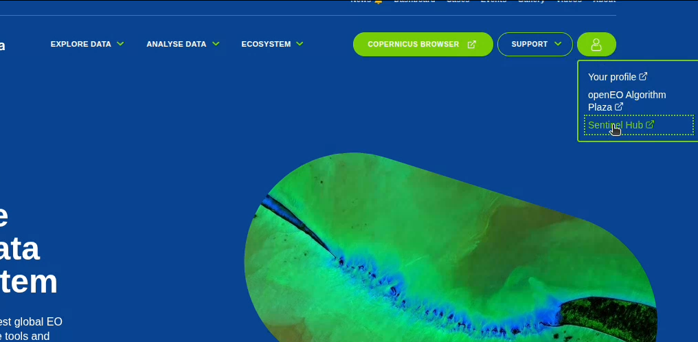

# ontopEO

ontopEO runs queries over Virtual Knowledge Graphs (VKG)s integrating relational
data in Postgresql and openEO data from Copernicus using the Ontop
platform.

## Description
This repository contains the pipeline and requirements for the project OntoEO.

Its components are the following:
- The code/branch of Ontop with the openEO functions
- A pipeline which loads geospatial and other data into a PostgreSQL database
- PL/Python functions which enable querying of openEO which can
be found in the folder openEO

## Pre-requisites
### Data
In order to run all of the examples please download:
- From MapView data for South Tyrol. In the [themes](https://mapview.civis.bz.it/?context=PROV-BZ-GEOBROWSER-MAPVIEW&lang=it&bbox=590000,5120000,765000,5220000&epsg=EPSG:25832) 
to the left select comuni and send downloaded data to your email
- Download data on administrative divisions of Campania from [Geoportale Regione Campania](https://sit2.regione.campania.it/content/dati-di-base)
- Netherlands data from the [Dutch National Georegister](https://www.nationaalgeoregister.nl/geonetwork/srv/dut/catalog.search#/metadata/216FF6D5-9BC0-4B19-A4D7-FC131238D621)
All of the files should be placed in ... and imported via ...
### openEO
Executing the example queries requires access to an openEO cloud provider. 
The recommended provider is Copernicus where any user needs to follow the instructions and:
- Register for an account and obtain a user ID: https://documentation.dataspace.copernicus.eu/Registration.html
- Log in and navigate to Sentinel Hub 
- Navigate to "User Settings" below on the left and add an OAuth2 client secret

Action: Set in the file `.env` the two respective environment variables
`USER_OPENEO_CLIENT_ID` and `USER_OPENEO_CLIENT_SECRET`
based on the credentials generated in openEO

## Ontop
Our extension of Ontop has been added as a branch ...

We have also created a docker image for it ...

## Execution
In order to run the experiments. Please run:
```
docker compose up
```
This will initialize a PostgreSQL database at port 7777 and
Ontop at port 8080 where you can run the example queries.


