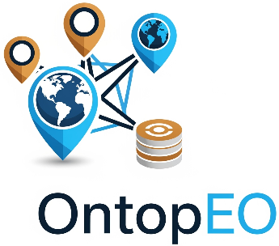
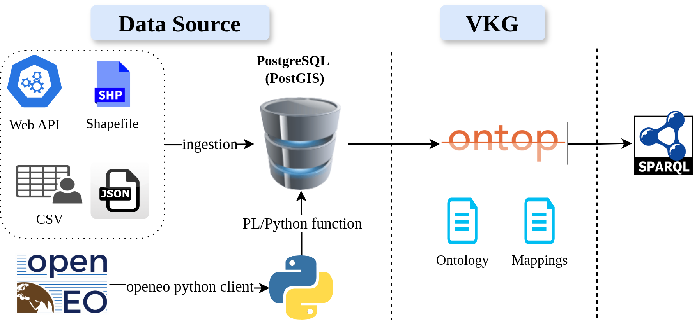
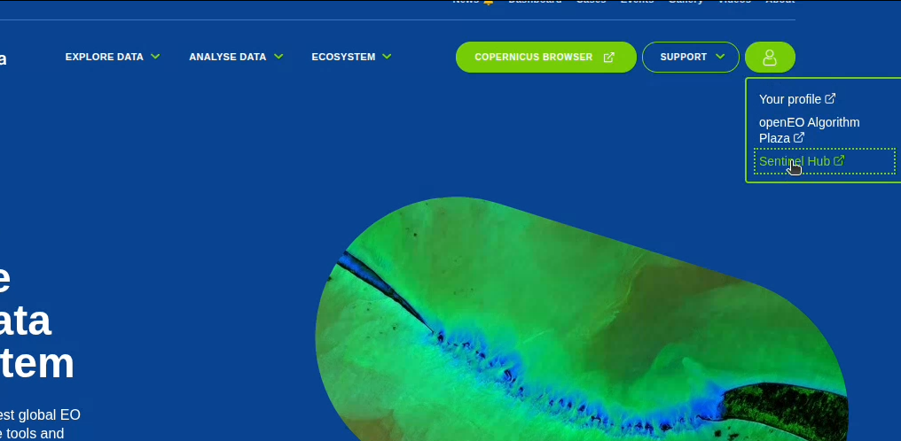

<p align="left">
  
</p>

# ontopEO


**ontopEO** runs queries over Virtual Knowledge Graphs (VKG)s integrating relational
data in Postgresql and openEO data from Copernicus using the [Ontop](https://ontop-vkg.org/]
platform).

## Description
In this repository we provide instructions and code on how to run
a sample pipeline with queries over openEO using a VKG.

The entirety of the pipeline relies on 3 main components:
- **Data**. A database which showcases integrated Ontop queries that make use of openEO
  and a variety of other data into a PostgreSQL database. See the fodler [db_import](./db_import/)
- **Ontop**. The branch of [Ontop](https://github.com/ontop/ontop) with the openEO SPARQL functions 
which can be found in [ontop/openeo-v2](https://github.com/apano-on/ontop/tree/feature/openeo-v2)
  - A list of supported openEO functions implemented in SPARQL is present in the file
  [OPENEO.java](https://github.com/apano-on/ontop/blob/feature/openeo-v2/core/model/src/main/java/it/unibz/inf/ontop/model/vocabulary/OPENEO.java) 
  - Each function corresponds to its openEO counterpart 
- **PL/Python**. PL/Python functions translate Ontop's SQL query with openEO arguments
to an openEO process graph. They can be found in the folder [pgsql](./pgsql/)

<div align="center">
  <div style="background-color: white; display: inline-block; padding: 10px;">
    
  </div>
</div>

We demonstrate how the pipeline can be used to run queries over openEO data and
relational data, with 8 real use cases listed in the file [openeo.toml](./vkg/openeo.toml),
which are adampted from examples presented in the Copernicus 
openEO [Jupyter Notebook Samples](https://documentation.dataspace.copernicus.eu/Usecase.html).

## Pre-requisites
### Data
To run all the examples, please download:
- From MapView data for South Tyrol. In the [themes](https://mapview.civis.bz.it/?context=PROV-BZ-GEOBROWSER-MAPVIEW&lang=it&bbox=590000,5120000,765000,5220000&epsg=EPSG:25832) 
to the left select "comuni" and send downloaded data to your email. Note that South Tyrol
data has already been added in this repo
- Download data on administrative divisions of Campania from [Geoportale Regione Campania](https://sit2.regione.campania.it/content/dati-di-base)
- Netherlands data from the [Dutch National Georegister](https://www.nationaalgeoregister.nl/geonetwork/srv/dut/catalog.search#/metadata/216FF6D5-9BC0-4B19-A4D7-FC131238D621)

All the files should be placed in [db_import/data](./db_import/data) and a respective
script to import the files should be updated in [db_import/import_data.sh](./db_import/import_data.sh).
For the PostGIS backend services like `shp2pgsql` and `ogr2ogr` can import the data.

### openEO
Executing the example queries requires access to an openEO cloud provider. 
The recommended provider is Copernicus where any user needs to follow the instructions and:
- Register for an account and obtain a user ID: https://documentation.dataspace.copernicus.eu/Registration.html
- Log in and navigate to Sentinel Hub 



- On the new page, navigate to "User Settings" (below on the left) and add an 
OAuth2 client secret

**Action**: Set in the file `.env` the two respective environment variables
`USER_OPENEO_CLIENT_ID` and `USER_OPENEO_CLIENT_SECRET`
based on the credentials generated in openEO

### Ontop
#### Source code
We have also created a docker image for [ontop-openeo](https://hub.docker.com/repository/docker/albulenpano/ontop-openeo/general),
which we use in this example and can be updated in the docker compose file.

#### Mappings
For every new dataset being mapped from the PostgreSQL database to Ontop, a respective mapping
needs to be added in [vkg/openeo.obda](./vkg/openeo.obda). Note that unused mappings can
be removed or commented using a semicolon ";". The namespace prefix we have chosen for `OPENEO`
is `http://www.openeo-ontop.org#`.

#### Ontology
No ontology was used for this example. However, to extend the demo, please add the 
ontology to the [vkg](./vkg/) folder and specify in the [docker compose file](docker-compose.yml) the property
`ONTOP_ONTOLOGY_FILE`.

## Running the demo
Please execute from the root directory of this project:
```
docker compose up
```
This will initialize a PostgreSQL database at port 7777 and
Ontop at port 8081, where you can run the example queries at localhost:8081 in your browser.


## Reference metadata
DOI: 10.5281/zenodo.15409222

Pano, Albulen. *ontopEO: beta-1* (beta-1). Zenodo, 2025. DOI: https://doi.org/10.5281/zenodo.15423395.
